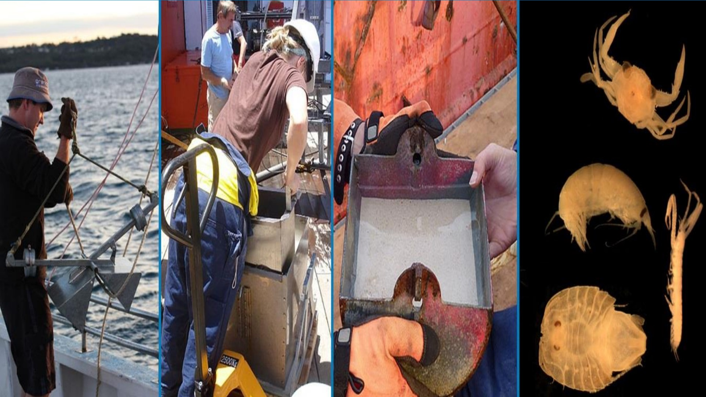

<a href="mailto:rachel.przeslawski@dpi.nsw.gov.au">Rachel Przeslawski</a>, Penny Berents, Malcolm Clark, Sabine Dittmann, Graham Edgar, Chris Frid, Garnet Hooper, Lauren Hughes, Tim Ingleton, David Kennedy, Scott Nichol & Jodie Smith

 

 
 
<strong>Chapter citation:</strong> Przeslawski R, Berents P, Clark M, Dittmann S, Edgar G, Frid C, Hooper G, Hughes L, Ingleton T, Kennedy D, Nichol S, Smith J. 2023. Marine sampling field manual for grabs and box corers. In <em>Field Manuals for Marine Sampling to Monitor Australian Waters, Version 2.1. </em>Przeslawski R, Foster S (Eds).<em> </em>National Environmental Science Programme (NESP).

| Chapter Contents                                                                                                                          |
|-------------------------------------------------------------------------------------------------------------------------------------------|
|  **[Platform Description](https://grabs-and-boxcorers-field-manual.github.io/platform-description)**                                                      |
|  **[Scope](https://grabs-and-boxcorers-field-manual.github.io/scope)**    |
|  **[Grabs and Box Corers in Marine Monitoring](https://grabs-and-boxcorers-field-manual.github.io/grabs-and-boxcorers-in-marine-monitoring)**                                            |
|  **[Equipment](https://grabs-and-boxcorers-field-manual.github.io/equipment)**      |
|  **[Pre-survey Preparations](https://grabs-and-boxcorers-field-manual.github.io/pre-survey-preparations)**                                                |
|       _[Pre-survey checklist](https://grabs-and-boxcorers-field-manual.github.io/pre-survey-preparations#pre-survey-checklist)_                                      |
|  **[Field Procedures](https://grabs-and-boxcorers-field-manual.github.io/field-procedures)**                                                              |
|       _[Onboard sample acquisition](https://grabs-and-boxcorers-field-manual.github.io/field-procedures#onboard-sample-acquisition)_                      |
|       _[Onboard sample processing & storage](https://grabs-and-boxcorers-field-manual.github.io/field-procedures#onboard-sample-processing--storage)_    |
|  **[Post-survey Procedures](https://grabs-and-boxcorers-field-manual.github.io/post-survey-procedures)**                                                  |
|       _[Sample curation and submission for analysis](https://grabs-and-boxcorers-field-manual.github.io/post-survey-procedures#sample-curation-and-submission-for-analysis)_                                      |
|       _[Data release](https://grabs-and-boxcorers-field-manual.github.io/post-survey-procedures#data-release)_                                      |
|  **[Field Manual Maintenance](https://grabs-and-boxcorers-field-manual.github.io/field-manual-maintenance)**                                              |
|  **[Acknowledgments](https://grabs-and-boxcorers-field-manual.github.io/acknowledgements)**                                                                |
|  **[References](https://grabs-and-boxcorers-field-manual.github.io/references)**                                                                          |

<a href="#" class="scrollUpButton">Back to top</a>
