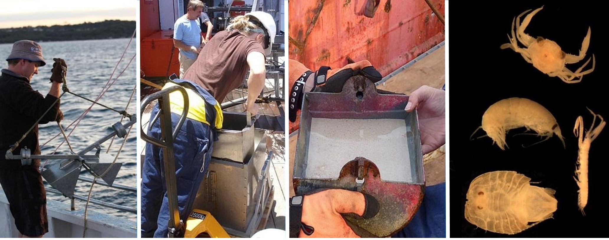

[Rachel Przeslawski](mailto:rachel.przeslawski@ga.gov.au), Penny Berents, Malcolm Clark, Sabine Dittmann, Graham Edgar, Chris Frid, Garnet Hooper, Lauren Hughes, Tim Ingleton, David Kennedy, Scott Nichol, Jodie Smith

Chapter citation:
Przeslawski R, Berents P, Clark M, Dittmann S, Edgar G, Frid C, Hooper G, Hughes L, Ingleton T, Kennedy D, Nichol S, Smith J. 2020. Marine sampling field manual for grabs and box corers. In <em>Field Manuals for Marine Sampling to Monitor Australian Waters, Version 2. </em>Przeslawski R, Foster S (Eds).<em> </em>National Environmental Science Programme (NESP).